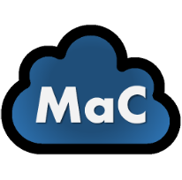

# Meetings As Code (MaC)



Everything is code, so... meetings are code too!

## When you programm a meeting

Your meetings should be:

```json
{
    "Clear"	:	"Include meeting objectives and an agenda in the event's invitation.",
    "Organized"	:	"Add documentation, so others can prepare their participation in the meeting.",
    "Directed"	:	"Indicate explicitly what you expect of each participant (e.g. decide x, or help design y)",
    "Empathic"	:	"If you can see the participants availability, if you cannot find a common available slot, contact the members with conflicting agendas and negociate an alternative"
}
```

**Mention [this repo](https://github.com/ptavaressilva/mac) in the invite, to help others programm meetings-as-code too!**

## When you attend a meeting planned by others

```json
{
    "Clear"	:	"Check if the meeting invite is MaC. If not, contact the organizer and tell them about this repo.",
    "Organized"	:	"Prepare the meeting, reading in advance the objectives and any materials shared by the organizer.",
    "Directed"	:	"Stick to the agenda. There is no problem if you reach the meeting's goals before the time runs out. Remember to leave a few minutes at the end to review together the next steps agreed during the meeting.",
    "Empathic"	:	"If you feel you won't contribute to the meeting, decline to participate, to help others respect your time."
}
```
